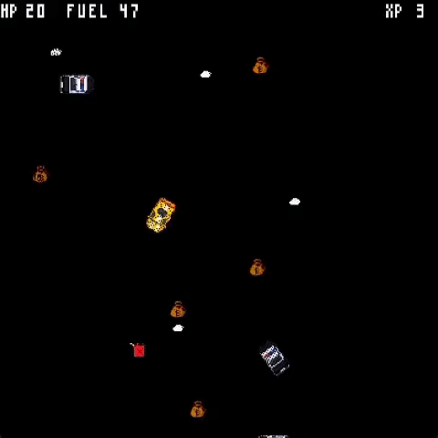
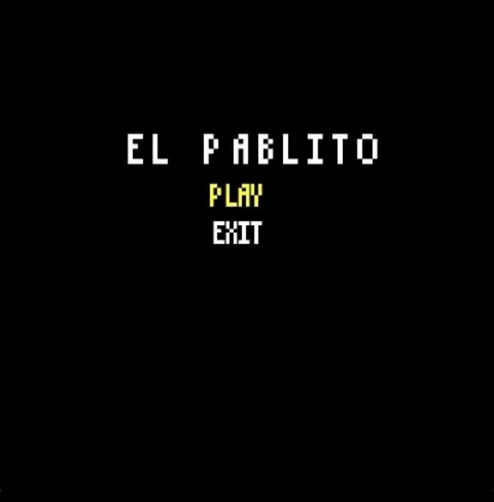
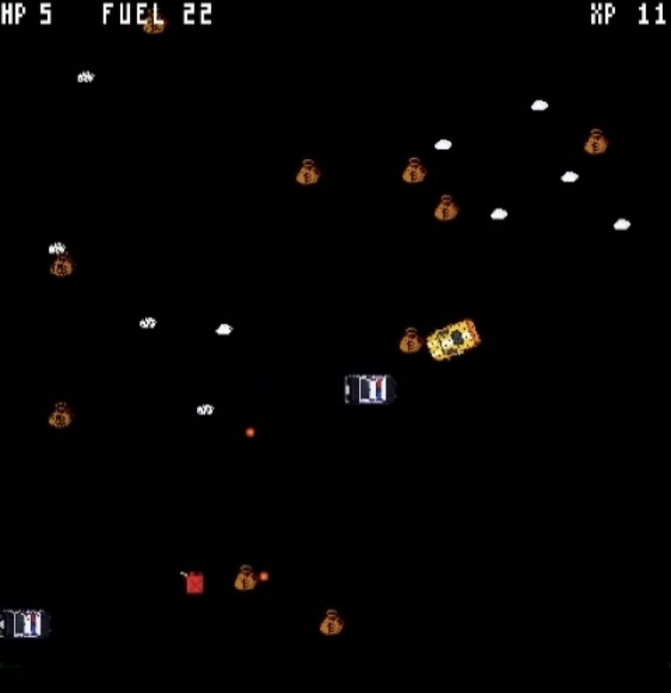
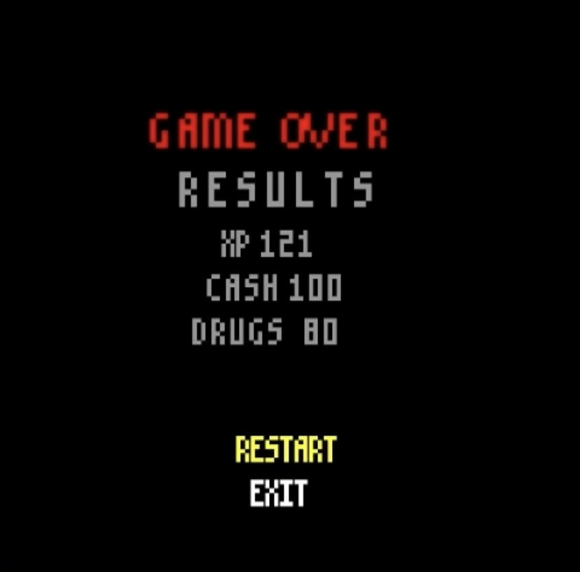

# L_06GR05 - El Pablito
## Description

In a world filled with corruption, there’s a man who thrives with his well manufactured cocaine - Pablito Cobar. Everything changes when a new police chief, Carlos Peña, sets Pablito and the gang as his highest priority, doing whatever it costs to put them behind bars. In an exchange that went wrong, Carlos starts a middle-of-the day chase behind Pablito - will Pablito survive the fight or there will be a new king in town?

El Pablito is an action shoot ‘em up survival game with roguelite elements.

This project was developed by [Diogo Sousa](https://pages.github.com/https://github.com/LordFam8) (up202204135@fe.up.pt), [Miguel Duarte](https://github.com/tommyvercetti10) (up202206102@fe.up.pt) and [Tomás Teixeira](https://github.com/tomast100) (up202208041@fe.up.pt) for LDTS 2023/2024.

## Game Preview
#

Gif 1. ElPablito Game

## Screenshots

  Fig 1. Main Menu

#

  FIG 2. Gameplay

#

  FIG 3. GameOver