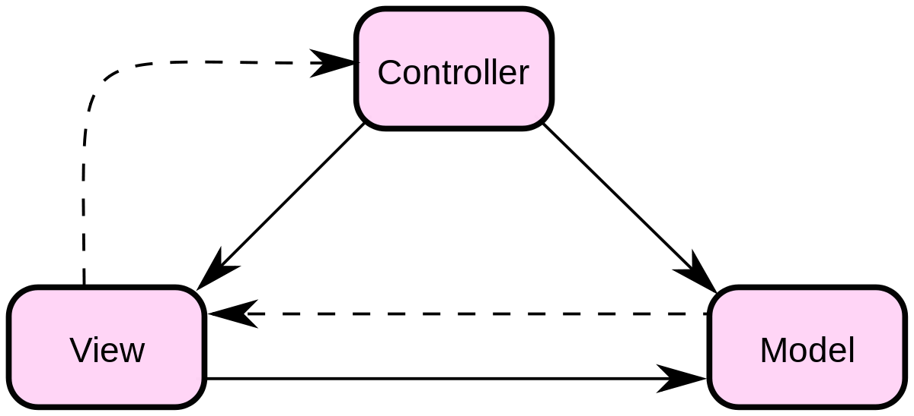
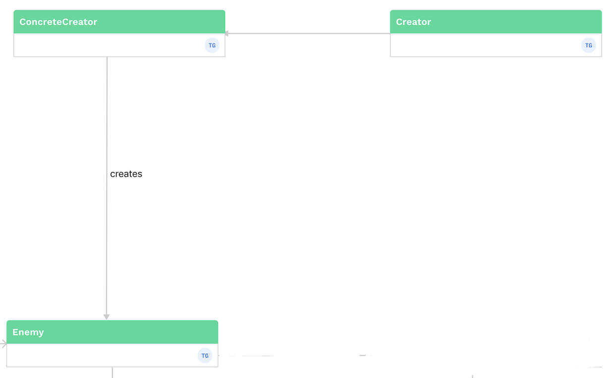
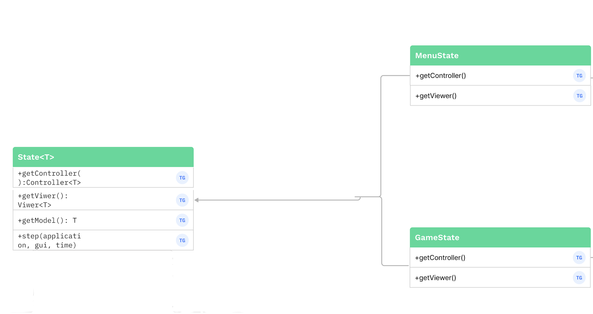
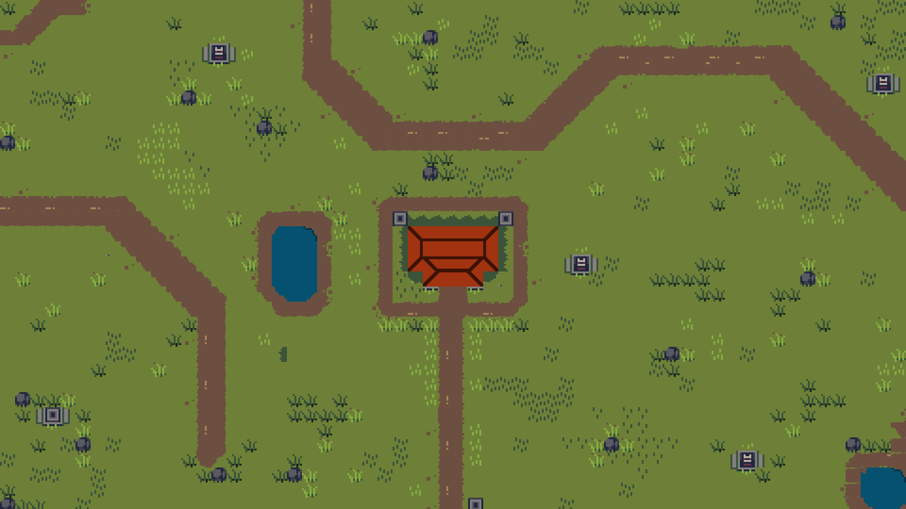
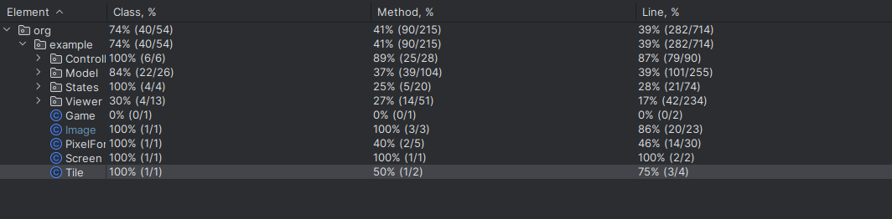
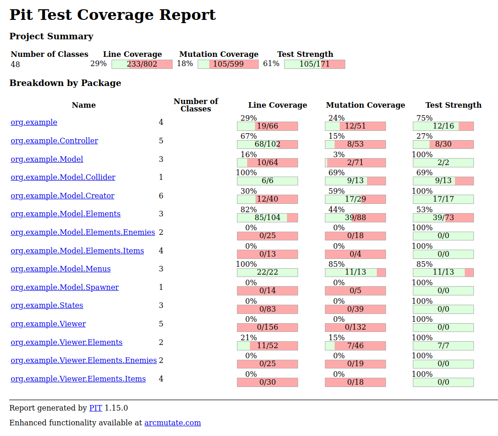

# L_06GR05 - El Pablito
## Description

Fig 1. Gameplay

In a world filled with corruption, there’s a man who thrives with his well manufactured cocaine - Pablito Cobar. Everything changes when a new police chief, Carlos Peña, sets Pablito and the gang as his highest priority, doing whatever it costs to put them behind bars. In an exchange that went wrong, Carlos starts a middle-of-the day chase behind Pablito - will Pablito survive the fight or there will be a new king in town?

El Pablito is an action shoot ‘em up survival game with roguelite elements.

###

The player controls Pablito’s armed car and enters a vast field (the city of Medellin, in Chile). His goal is to survive against waves of police forces, that comes in a huge variety of ways - cars, motorcycles, by feet or in helicopters. By defeating cops, the player gains experience and can level up, by improving his car, weapon or obtaining special items. At the same time, the player must fuel his car with gasoline, one of the items spread around the map. The player can also find money and some cocaine in the map. The collected money can be used in the beginning of future attempts to improve the player’s initial power, while the cocaine converts into money in the end of each attempt.

This project was developed by [Diogo Sousa](https://pages.github.com/https://github.com/LordFam8) (up202204135@fe.up.pt), [Miguel Duarte](https://github.com/tommyvercetti10) (up202206102@fe.up.pt) and [Tomás Teixeira](https://github.com/tomast100) (up202208041@fe.up.pt) for LDTS 2023/2024. This project was based on the **Asteroids** project provided by the teachers of this class.
## Planned Features

### Player

- **Character Movement and Shooting -** The car will be moved using the up arrow key to acelerate and the left and right arrow keys to change the angle so the player can go to the desired direction and shoot with the space key button. The shooting direction will be the same as to where the front of the car is looking at. Collisions should be implemented so the player loses some HP when colliding with an enemy.

- **HP, Experience and Gasoline** - During the gameplay, the player must focus on 3 fundamental bars:

  - **HP:** The current life of the player. It must decrease on the collision with enemies and increase when using some items.
  - **Experience:** The current experience and level of the player. The experience must increase a bit when defeating an enemy or increasing the numbers of drugs and cash, although this experience will just be shown when the player dies.
  - **Gasoline:** The current gasoline of the player’s car. It must decrease a bit every second and increase when the player finds a gasoline item in the map. When the gasoline is empty, the car must stop moving.

### Enemies

- **Spawn** - The enemies should spawn in the corners of the map, at a random position.

- **Movement** - Since the first frame of the spawn, the enemies should move in a straight line through the map until they disappear or get killed. Each enemy must have a default movement speed. 

- **HP and Death** - When colliding with a player’s bullet, each enemy must decrease its HP. When the HP reaches 0, the enemy should die, disappearing from the map and increasing the player’s experience.

### Others

- **Menus and Death/Victory Screen** - A simple main menu should appear when booting the game, with start and exit buttons. A death screen should appear when the player looses, showing some game stats and giving another chance to replay the game.

- **Basic Save System** - A basic save system should be implemented with the current money count of the player.

- **Sound Design** - A game can’t be complete without some sound. A song must repeat on loop during the gameplay and some basic sound effects should be implemented.

## Design

Fig 2. UML

### **Architetural Pattern**

**Problem in context**

In order to find the perfect foundation in which the game will be built, we found that it was extremely important to take a look into architetural patterns and choose an approach as early as possible. 

**The Pattern**

We decided to use the MVC pattern, that separates the code in three elements:

- **Model (data)** - Stores all the data and represents the logic of the game.
- **View (gui)** - Responsible for displaying the GUI of each component and sending user actions to the controller.
- **Controller (rules)** - An itermediary between the Model and the View.

**Implementation**

Fig 3. MVC Diagram

**Advantages**

- It becomes easier to do some tests
- Easy modification and higher cohesion

### Entity Spawn

**Problem in context**

When spawning entities (like enemies or power-ups), we found that we needed a pattern who could easily instantiate and manage those entities. 

**The Pattern**

We decided to use the **Factory Pattern**. This pattern provides an interface for creating instances of a class but let sub-classes decide which class to instantiate and alter. For example, we have an ‘ElementFactory’ class responsible for creating different types of elements based on some criteria.

**Implementation**

Fig 4. Factory Pattern

**Advantages**

- The code is easier to understand (more modular)
- Adding new enemies type and factories is simplified

### Game State

**Problem in context**

Our game will alternate between the map (Game State) and the menus (Menu State). We need a structure to manage these different states easily.

**The Pattern**

We decided to use the **State Pattern** to implement this structure. This pattern allows an object to alter its behavior when its internal state changes. The object will appear to change its class. This pattern was a perfect fit for ourcase, allowing the game to seamlessly transition between the two states.

**Implementation**

Fig 5. State Pattern

**Advantages**

- A more modular structure, making it easier to add new states if needed or modifying any existing state.
- Improves the readability of the code, encapsulating the state-specific logic in separated classes.

## Special Considerations

### Map
At the beginning of the project, as we wanted to use images and not characters, we started by creating our own map appropriated to the game.
Unfortunately, as we could only use Lanterna, the game was very slow and "lagged" with the map. The car used to make every movement with intervals
of one second, so as we could not use any external API, we just eliminated the map and decided to have Pablito running away from the police on a simple black background.

Fig 6. Map

## Code smells
We've successfully addressed all the identified code smells, but despite our efforts, there are still some notably extensive classes for which we couldn't find a practical alternative within the time constraints.

## Testing

### Coverage screenshot

Fig 7. Code Coverage screenshot

### Mutation Test-Pit screenshot

Fig 8. Mutation Test-Pit screenshot

## Self-evaluation
- Diogo Sousa: 33.3
- Miguel Duarte: 33.3
- Tomás Teixeira: 33.3
